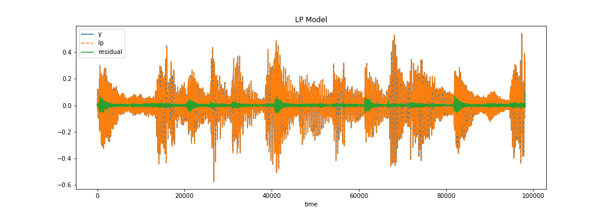

# Residual Phase from LP residual

This repository contains a tool for the calculation of the residual phase from the linear prediction (LP) residual of a wave signal. <br>

The calculation of LP residual is equal to the error between the original signal and the LP-predicted signal.
From the LP residual, the residual phase is defined as the cosine of the phase function of the analytic signal.

# Usage

Being y an array containing samples from a wave signal, the residual phase of the sampled wave can be obtained with

```
from residualphase import residual_phase

res_phase = residual_phase(y)
```

# Plot

Plot of the original signal (y), LP-predicted signal (lp) and LP residual (r). 





